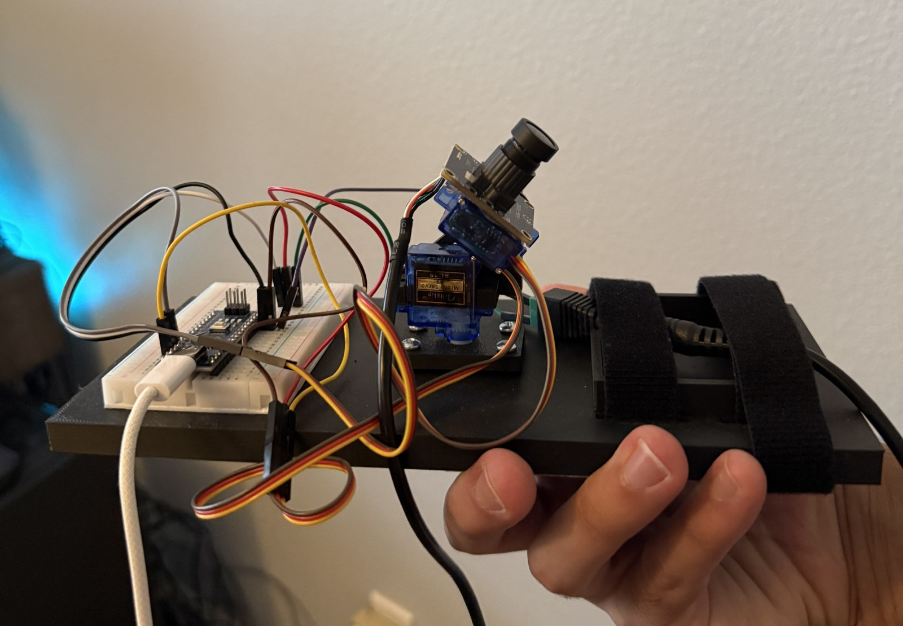
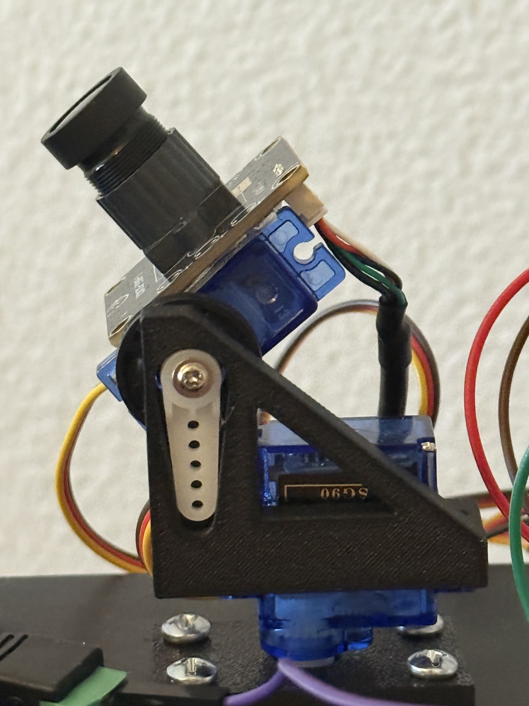
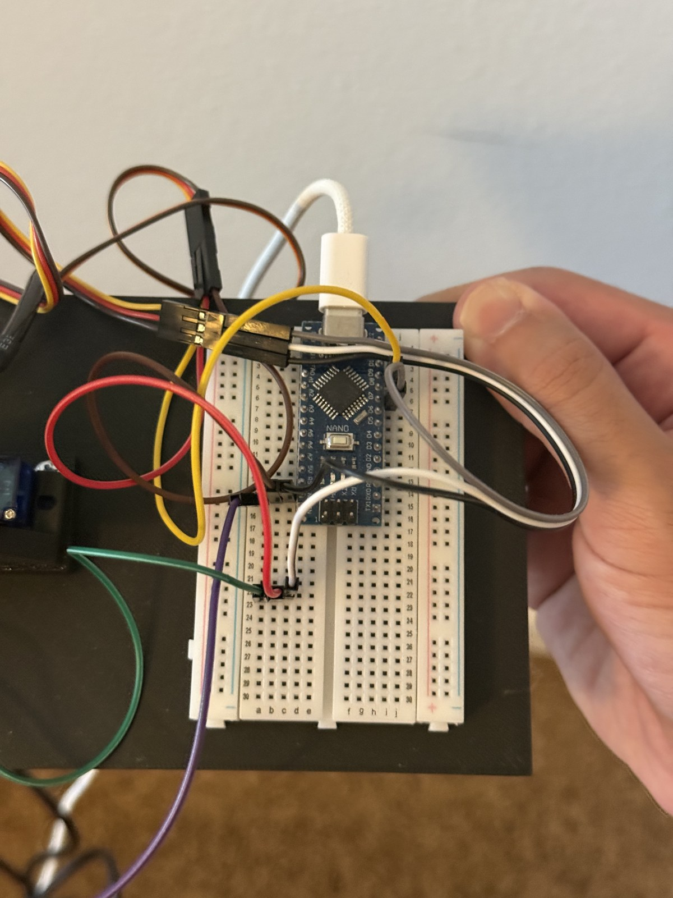
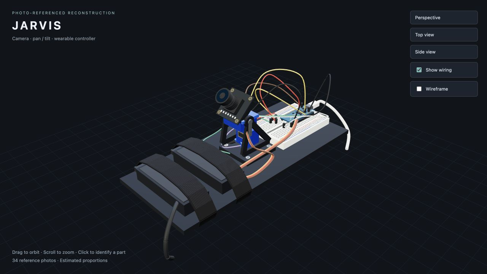

# JARVIS

**A personal robotics assistant that sees, listens, remembers, and responds.**



[Explore the 3D model](#3d-model) · [Hardware close-ups](#the-hardware) · [Get started](#running-the-project)

JARVIS combines a webcam on a two-servo mount with face tracking, hand gestures, voice interaction, and personal memory. I built it to explore how an assistant can understand both what is happening in a room and what it already knows about its user.

The original application was written as a hands-on learning project without AI-generated code. Repository cleanup, setup helpers, small portability fixes, and the photo-referenced 3D model were subsequently assisted by AI; the original modules and application flow are preserved.

[Setup guide](docs/SETUP.md) · [Dependency inventory](docs/DEPENDENCIES.md) · [Architecture](docs/ARCHITECTURE.md) · [Hardware](hardware/README.md)

## The hardware

The real prototype brings together a camera on a pan-and-tilt servo mount, a breadboard controller, exposed jumper wiring, and a black mounting plate with two fastening straps.

| Camera and servo assembly | Breadboard and controller |
| --- | --- |
|  |  |

These three photographs were selected from the original 34-image reference set to show the overall build and its two main assemblies.

## 3D model

[](docs/model/README.md)

The model recreates the mounting plate, straps, pan-and-tilt camera, breadboard, controller, and wiring as 57 named component/material meshes.

- **[Download the complete 3D package](https://github.com/kamransalahuddin/JARVIS/raw/refs/heads/main/docs/model/JARVIS-3D.zip)** — GLB, OBJ/MTL, offline viewer, and editable generation source.
- **[Download the GLB model](https://github.com/kamransalahuddin/JARVIS/raw/refs/heads/main/docs/model/JARVIS.glb)** — import into a compatible 3D editor or viewer.
- **[Download the interactive viewer](https://github.com/kamransalahuddin/JARVIS/raw/refs/heads/main/docs/model/JARVIS-viewer.html)** — open the downloaded HTML in a browser, then drag to rotate, scroll to zoom, or hide the wiring. Everything is bundled for offline use.
- [Model details and rebuild instructions](docs/model/README.md).

GitHub displays the preview above; the interactive viewer runs after download. This is a visual reconstruction with estimated dimensions, not a measured scan or manufacturing-ready CAD model.

## What it does

| Capability | Implementation |
| --- | --- |
| Follow a face | OpenSeeFace nose landmarks → serial coordinates → servo-mounted webcam |
| Recognize hand gestures | MediaPipe live-stream recognition → Kasa smart-light commands |
| Listen and speak | MLX Whisper transcription → Gemini responses → ElevenLabs streaming speech |
| Retrieve personal context | Qwen multimodal embeddings, NumPy similarity search, and a local text knowledge base |
| Respond to surroundings | Periodic camera-frame comparison and on-demand image requests to Gemini |
| Detect people and objects | Ultralytics YOLO26 integration; detection is enabled in the vision demo, while its call is commented out in the main loop |

## Running the project

**Try the vision demo without API keys or robotics hardware.** Install Python 3.11 and Git, download this repository, and open **Start.command** on macOS or **Start.bat** on Windows. The first launch installs dependencies and models; allow camera access when prompted.

For terminal setup on macOS/Linux:

```bash
python3.11 scripts/setup.py --vision-only
.venv-jarvis/bin/python scripts/start.py --vision-only
```

For the full voice assistant, run setup without `--vision-only`, fill the API keys in `.env`, then run `.venv-jarvis/bin/python scripts/start.py`. Arduino output and smart-light control are optional settings. See the [setup guide](docs/SETUP.md) for Windows commands, credentials, hardware, and troubleshooting.

**Validation target: Apple Silicon macOS, Python 3.11.** Windows and Linux launch paths are provided but have not been tested on those operating systems. First-time model downloads can take several minutes. This is a working robotics prototype, not a universally validated installer.

Voice controls: **“stop”** pauses conversational replies, **“listen”** resumes them, **“look”** requests a description of the saved scene, and **“stop everything”** exits the main loop. Press **Escape** in the camera window to exit. The first saved second frame is available after approximately two minutes; `look` depends on that file.

## Repository map

```text
JARVIS/
├── README.md                  Project overview
├── Start.command / Start.bat  First-run camera demo
├── scripts/                   Setup and launch helpers
├── requirements.txt           Default pinned installation
├── .env.example               API keys and smart-plug configuration template
├── docs/                      Setup, architecture, photos, and 3D model
├── examples/                  Non-personal starter knowledge
├── hardware/                  Original Arduino firmware and wiring notes
├── patches/                   Existing OpenSeeFace compatibility fix
├── requirements/              Direct dependencies, complete lock, experiments, archive
└── src/
    ├── main.py                Application entry point
    ├── jarvis_core/  Vision, voice, scene and device integration
    └── rag_system/            Knowledge loading and embedding retrieval
```

Downloaded models, external checkouts, private memory, chat history, and captured frames remain local and are ignored by Git. Source paths are preserved because the imports and model locations depend on them.

## Design and next steps

The project connects real-time perception with persistent context and physical interaction. Its main engineering challenges are coordinating camera and audio work, translating visual landmarks into hardware motion, and choosing useful memories for a spoken response.

Future work includes testing on more operating systems, improving cloud/device failure recovery, and benchmarking latency. See the [architecture guide](docs/ARCHITECTURE.md) for current limitations and the small setup-related changes.

## Attribution

The gesture component retains its existing [Apache 2.0 license](src/jarvis_core/LICENSE.txt) and author credit. Face tracking uses [OpenSeeFace](https://github.com/emilianavt/OpenSeeFace). See [third-party notices](docs/THIRD_PARTY.md) for component and model sources. No new project-wide license is asserted by this cleanup.
