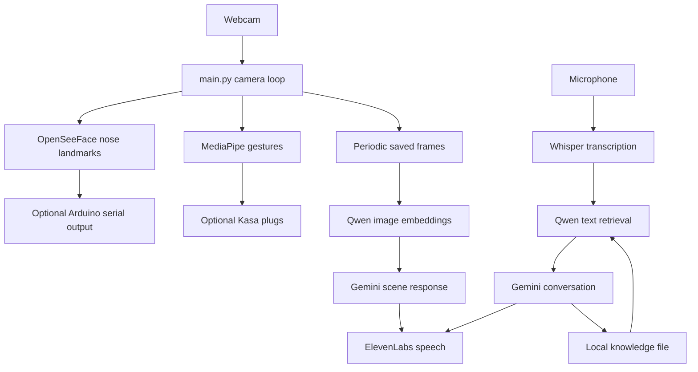

# Architecture

[Back to JARVIS](../README.md)

JARVIS keeps the original Python modules and execution flow: the camera loop runs in the main thread, voice interaction runs in a daemon thread, and scene comparisons run in additional threads.

## Module map

| File | Role |
| --- | --- |
| `src/main.py` | Webcam loop, tracking calls, scene timing, voice thread, exit controls |
| `src/assistant_runtime/nose_cam.py` | Face landmarks, frame-center offsets, optional serial output |
| `hand_tracker.py` | Asynchronous MediaPipe gesture recognition and landmark drawing |
| `light_logic.py`, `tp_link.py` | Gesture state transitions and optional Kasa commands |
| `AI.py` | Audio capture, transcription, Gemini chat, speech playback, memory summarization |
| `scene_monitor.py` | Image similarity and Gemini scene requests |
| `YOLO.py` | YOLO detections and object-tracking experiments |
| `src/rag_system/rag.py` | Read `#`-separated knowledge |
| `src/rag_system/embedding.py` | Embed entries, rank by cosine similarity, retrieve up to three |
| `demo_main.py` | Existing camera-only demo, including YOLO |
| `scripts/setup.py`, `scripts/start.py` | Installation and launch wrappers; no replacement application architecture |

Paths without a prefix in the table belong to `src/assistant_runtime/`.

## Entry points and experiments

Use `scripts/start.py` for the full assistant or add `--vision-only` for the demo. The launch wrapper ensures root-relative file paths work from any initial terminal directory.

`context_window.py` is an older context helper; the active summarization logic is in `AI.py`. `voice_transcription.py` is a separate Transformers Whisper test. `gemini-testing.py` explores preview TTS. `media_see.py` explores MediaPipe's API. `jarvis_threading.py` is empty. These remain in place to preserve the author's source organization and learning history.

## Small portability changes

- Read camera, serial, optional lights, and service model/voice settings from `.env`.
- Keep face tracking active when servo output is disabled.
- Select MLX Whisper on Apple Silicon and a lazy-loaded PyTorch Whisper fallback elsewhere.
- Give a readable error if the first camera frame is missing; clean up the demo camera on exit.
- Retrieve fewer than three memories safely, and save new entries to the same file read on startup.
- Convert OpenCV BGR frames to RGB image inputs for the embedding model; report an early `look` request when the saved scene does not exist.
- Reproduce the author's existing external Tracker shape fix during setup.

No module moves, class hierarchy, event framework, or replacement threading system was introduced.

## Remaining limitations

The application still initializes models and the microphone during imports. Threads share mutable state, and cloud/device failures do not all have retry handling. Scene capture uses fixed local filenames and an approximately two-minute comparison cycle. The main camera image is rotated 180 degrees for the original mount. Object detection is called in the demo; its call remains commented out in `main.py`. Real-time performance, provider access, and physical-device behavior require testing in the intended environment.
